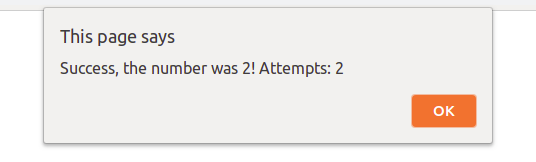

# The Guessing Game

## Create a guessing game for players. 

* Create a function named `randomNum()` without parameters.
* The function `randomNum()` should return a random number between __1__ and __10__.
* Create another function `guessingGame()` and Make the player guess the number in a *prompt*, then write a code that compares the *prompt* value the user inserted with the random number returned by the function `randomNum()`.
* The player has 3 guessing attempts. Store the number of remaining attempts in a variable named `counter`

 

* If the number chosen by the player matches the random number returned by the function `randomNum()`, a message that says __"Success!"__ should be displayed in the prompt dialog in addition to the number of attempts the player used. 

 

* If the player's guess is incorrect, the message, __"Wrong. Try again!"__ should be displayed to the player in the prompt dialog. 

 

* If the player fails to guess the number after three attempts, the message __"Sorry, you failed to guess the number in three attempts."__ in addition to the correct random number returned by the function `randomNum()` should be displayed in the prompt dialog.

 

**See the images for reference**

[//]: # (autograding info start)
#  Results
> ⌛ Give it a minute. As long as you see the orange dot  on top, CodeBuddy is still processing. Refresh this page to see it's current status.
>
> This is what CodeBuddy found when running your code. It is to show you what you have achieved and to give you hints on how to complete the exercise.

### Guessing Game

|                 Status                  | Check                                                                                    |
| :-------------------------------------: | :--------------------------------------------------------------------------------------- |
|  | `randomNum` returns a random number between 1 and 10 |
|  | three atemps should be available |
|  | success message is displayed upon correct guess |
|  | failure message is displayed upon three incorrect guesses |

[🔬 Results Details](../../actions)
[🐞 Tips on Debugging](https://github.com/DCI-EdTech/autograding-setup/wiki/How-to-work-with-CodeBuddy)
[📢 Report Problem](https://docs.google.com/forms/d/e/1FAIpQLSfS8wPh6bCMTLF2wmjiE5_UhPiOEnubEwwPLN_M8zTCjx5qbg/viewform?usp=pp_url&entry.652569746=Browser-DOM-window)

[//]: # (autograding info end)