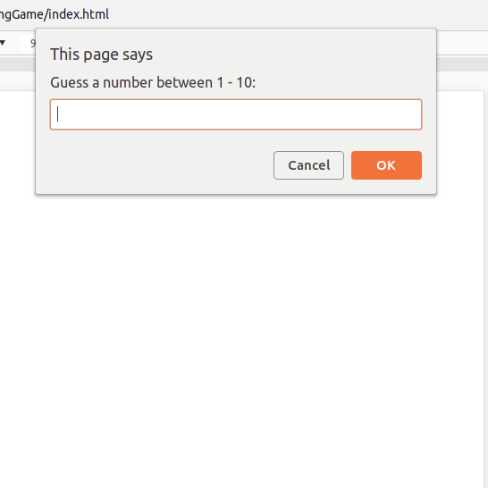
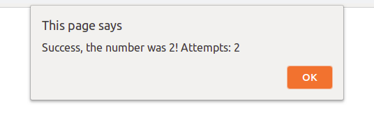
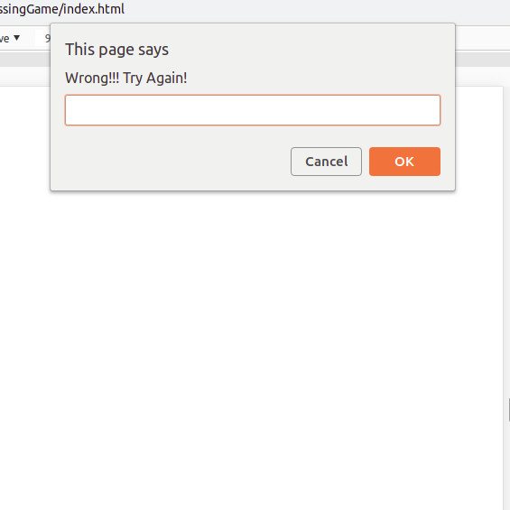
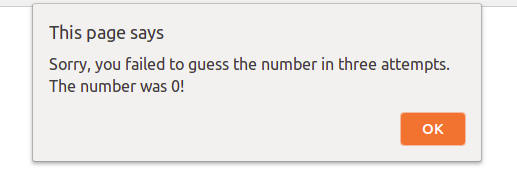

# The Guessing Game
## Erstelle ein Ratespiel für die Spieler.

* Erstelle eine Funktion namens `randomNum()` ohne Parameter.
* Die Funktion `randomNum()` sollte eine Zufallszahl zwischen __1__ und __10__ zurückgeben.
* Erstelle eine weitere Funktion `guessingGame()` und lass den Spieler die Zahl in einer *Eingabeaufforderung*(prompt) erraten. Schreibe dann einen Code, der den Wert, den der Benutzer eingegeben hat, mit der Zufallszahl vergleicht, die von der Funktion `randomNum()` zurückgegeben wird.
* Der Spieler hat 3 Versuche zum Raten. Speichere die Anzahl der verbleibenden Versuche in einer Variablen namens `counter`.

* Wenn die vom Spieler gewählte Zahl mit der Zufallszahl übereinstimmt, die von der Funktion `randomNum()` zurückgegeben wird, sollte im Eingabeaufforderungsdialog zusätzlich zur Anzahl der Versuche, die der Spieler benutzt hat, die Meldung __"Success!"__ angezeigt werden.

* Wenn die Vermutung des Spielers falsch ist, sollte die Meldung __"Wrong. Try again!"__ dem Spieler im Aufforderungsdialog angezeigt werden.

* Wenn der Spieler die Zahl nach drei Versuchen nicht erraten kann, sollte die Meldung __"Sorry, you failed to guess the number in three attempts."__ zusätzlich zur richtigen Zufallszahl, die von der Funktion `randomNum()` zurückgegeben wird, im Prompt-Dialog angezeigt werden.

**Siehe die Bilder als Referenz**
