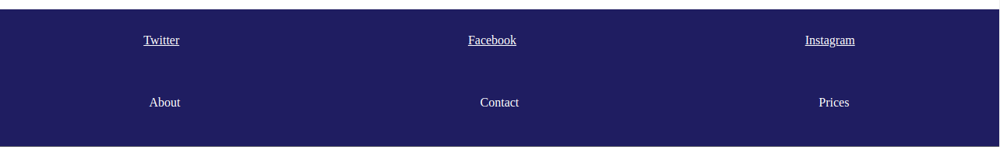

# Extreme Travel Website!

**Anweisungen**:
* Verwende nur JavaScript, um die Aufgaben zu lösen, keine Änderungen im CSS.

* Wähle die `header` aus, die der Überschrift `h1` am nächsten steht. Gib der `header` einen festen Rahmen von 5px. 

* Wenn der Abschnitt `.info` ein Element mit der Klasse `.info-package` enthält, wähle alle `.package-title` Elemente aus und gib dem jeweils vorhergehenden Geschwisterelement einen Rahmen. 

* Prüfe für jedes Info-Label, ob es mit dem Selektor `.mild` übereinstimmt. Wenn ja, erhält das Label einen `yellow` solid Rahmen. Wenn das Label auf den Selektor `.intense` zutrifft, erhält es einen `orange` solid Rahmen. Stimmt die Klasse mit keiner der beiden Klassen überein, erhält die Beschriftung einen roten, durchgehenden Rahmen. 

* Füge eine Kopie aller untergeordneten Elemente von `.nav-list` zur `.site-map` der Fußzeile hinzu. Hinweis: Die `.nav-list` sollte ihre Kinder behalten. 

**Bonus**
 - Analog zur vorherigen Aufgabe: Verschiebe die Listen-Elemente von `navList` zu `siteMap` (also keine Kopie)
 - Kommentiere zum Testen die vorherige For-Schleife aus

Nachdem du die Aufgabe erledigt und den Lösungszweig veröffentlicht hast, kannst du einen neuen Zweig `feature/restyle` erstellen und das Design der Landing-Page ändern. Du kannst sie auf GitHub Pages veröffentlichen, wenn du mit dem Ergebnis zufrieden bist.

**Hinweise**:
* Deadline: ~2h.
* Siehe Bilder als Referenz.

[//]: # (autograding info start)
#  Results
> ⌛ Give it a minute. As long as you see the orange dot  on top, CodeBuddy is still processing. Refresh this page to see it's current status.
>
> This is what CodeBuddy found when running your code. It is to show you what you have achieved and to give you hints on how to complete the exercise.

### Header

|                 Status                  | Check                                                                                    |
| :-------------------------------------: | :--------------------------------------------------------------------------------------- |
|  | closest parent `header` to `h1` has border style `5px solid rgb` |

### Info Section

|                 Status                  | Check                                                                                    |
| :-------------------------------------: | :--------------------------------------------------------------------------------------- |
|  | previous sibling of `.package-title` has border style `2px solid #072F5F` |

### Labels

|                 Status                  | Check                                                                                    |
| :-------------------------------------: | :--------------------------------------------------------------------------------------- |
|  | `.mild` and `.intense` labels have `yellow` or `orange` border |

### Footer Navigation

|                 Status                  | Check                                                                                    |
| :-------------------------------------: | :--------------------------------------------------------------------------------------- |
|  | Footer `.site-map` contains copy of children of `.nav-list`. |

[🔬 Results Details](../../actions)
[🐞 Tips on Debugging](https://github.com/DCI-EdTech/autograding-setup/wiki/How-to-work-with-CodeBuddy)
[📢 Report Problem](https://docs.google.com/forms/d/e/1FAIpQLSfS8wPh6bCMTLF2wmjiE5_UhPiOEnubEwwPLN_M8zTCjx5qbg/viewform?usp=pp_url&entry.652569746=SPA-DOM-Traversing)

[//]: # (autograding info end)