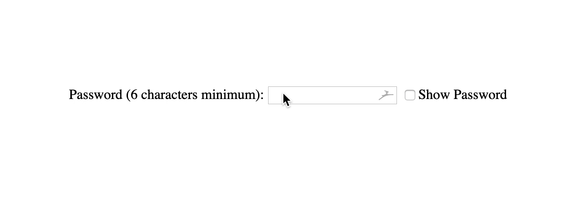

# Form Password Field

1. Create a form with a password input field in `index.html`
 - Use appropriate _attributes_ for `input` field. i.e. `type`, etc.

1. Create a `checkbox` and write a function that enables the user to _show/hide_ the password.

1. The **password** should consist of _minimum 6 characters_.

1. **Optional:** Style the `form`.

> Hint: Refer to the representation below, for an idea of what your result should look like.

[//]: # (autograding info start)
#  Results
> ⌛ Give it a minute. As long as you see the orange dot  on top, CodeBuddy is still processing. Refresh this page to see it's current status.
>
> This is what CodeBuddy found when running your code. It is to show you what you have achieved and to give you hints on how to complete the exercise.

### Passoword field

|                 Status                  | Check                                                                                    |
| :-------------------------------------: | :--------------------------------------------------------------------------------------- |
|  | Page Should contain a Passoword field |

### Password Length

|                 Status                  | Check                                                                                    |
| :-------------------------------------: | :--------------------------------------------------------------------------------------- |
|  | Minimum Password Length should be 6 characters |

### Show password

|                 Status                  | Check                                                                                    |
| :-------------------------------------: | :--------------------------------------------------------------------------------------- |
|  | Page contains 'Show Password' checkbox |
|  | Should allow user to toggle password visibility |

[🔬 Results Details](../../actions)
[🐞 Tips on Debugging](https://github.com/DCI-EdTech/autograding-setup/wiki/How-to-work-with-CodeBuddy)
[📢 Report Problem](https://docs.google.com/forms/d/e/1FAIpQLSfS8wPh6bCMTLF2wmjiE5_UhPiOEnubEwwPLN_M8zTCjx5qbg/viewform?usp=pp_url&entry.652569746=Browser-PasswordField)

[//]: # (autograding info end)