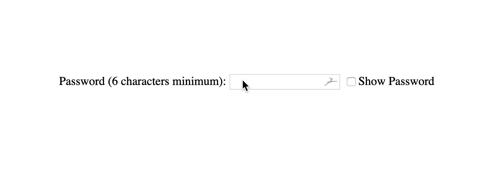

# Formular Passwortfeld

1. Erstelle ein Formular mit einem Passwort-Eingabefeld in `index.html`.
 - Verwende geeignete _Attribute_ für das Eingabefeld (`input`), z. B. `Typ` usw.

2. Erstelle ein Kontrollkästchen (`checkbox`) und schreibe eine Funktion, mit der der Nutzer das Passwort _ein-/ausblenden_ kann.

- Das **Passwort** sollte aus _mindestens 6 Zeichen_ bestehen.

4. **Optional:** Gestalte das Formular (`from`).

> Tipp: Schau dir die folgende Darstellung an, um eine Vorstellung davon zu bekommen, wie dein Ergebnis aussehen sollte.

## TIPPS:
- du kannst als event für die checkbox "change"  anstatt "click"nehmen. 
- mittels `.checked` kann man testen, ob eine checkbox gecheckt ist
- z.B. `if( document.querySelector('input[type=checkbox]').checked)` ;
