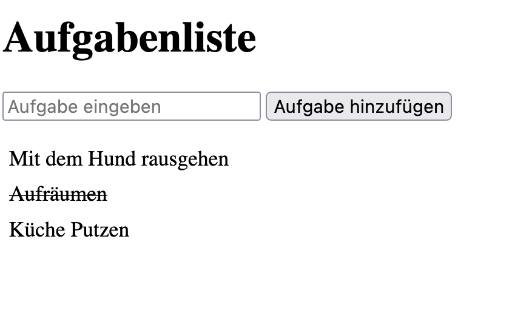

# Event Bubbling Todo

In dieser Übung erstellst du eine einfache Aufgabenlisten-Anwendung, um die Konzepte der Event-Propagation, Delegation und Bubbling zu üben. Du fügst Aufgaben zur Liste hinzu, und wenn du auf eine Aufgabe klickst, wird sie als abgeschlossen markiert. 

Die einzelne Schritte findest du dazu in der index.html. 

