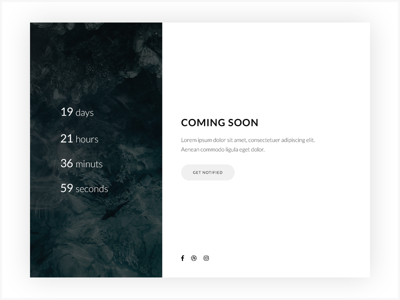

# Coming Soon Page

## Tasks:
- Create a coming soon WebPage.
- Work with the starter code in the `src` folder.
- Create a `main` element container and give it id `countdown` to display the countdown inside it.
- The page should show a countdown of __**days, hours, minutes, and seconds**__ .
- The end date of the coming soon countdown is at 16 o'clock on the fourth of February 2025 " *04/02/2025 at 16:00* "

- To run the app, try `$ npm run start`

- For easier date handling you can use [momentjs](https://momentjs.com)
- Example of a completed project 
- Inspired by https://dribbble.com/shots/5188890-Modern-Coming-Soon-Template

[//]: # (autograding info start)
#  Results
> ⌛ Give it a minute. As long as you see the orange dot  on top, CodeBuddy is still processing. Refresh this page to see it's current status.
>
> This is what CodeBuddy found when running your code. It is to show you what you have achieved and to give you hints on how to complete the exercise.

### Task1: Page exists

|                 Status                  | Check                                                                                    |
| :-------------------------------------: | :--------------------------------------------------------------------------------------- |
|  | `#countdown` container should contain a countdown clock |

### Days countdown

|                 Status                  | Check                                                                                    |
| :-------------------------------------: | :--------------------------------------------------------------------------------------- |
|  | Countdown should display remaining days until fourth of February 2025 16 o'clock |

### Hours countdown

|                 Status                  | Check                                                                                    |
| :-------------------------------------: | :--------------------------------------------------------------------------------------- |
|  | Countdown should display correct number of remaining hours |

### Minutes countdown

|                 Status                  | Check                                                                                    |
| :-------------------------------------: | :--------------------------------------------------------------------------------------- |
|  | Countdown should display correct number of remaining minutes |

[🔬 Results Details](../../actions)
[🐞 Tips on Debugging](https://github.com/DCI-EdTech/autograding-setup/wiki/How-to-work-with-CodeBuddy)
[📢 Report Problem](https://docs.google.com/forms/d/e/1FAIpQLSfS8wPh6bCMTLF2wmjiE5_UhPiOEnubEwwPLN_M8zTCjx5qbg/viewform?usp=pp_url&entry.652569746=Browser-ComingSoon)

[//]: # (autograding info end)