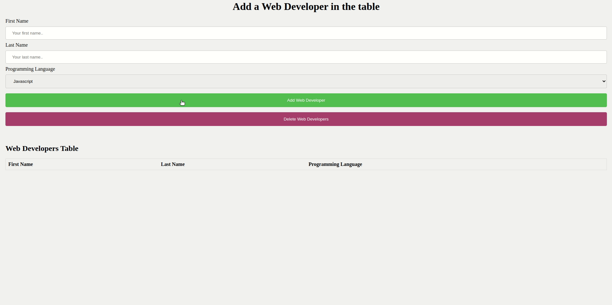

# SPA - ASYNCRONOUS PROGRAMMING - LOCAL STORAGE

Der **_Local Storage_** (dt. "lokale Speicher") ermöglicht Entwickler\*innen, Daten im Browser zu speichern und laden. Die im lokalen Speicher abgelegten Daten verfallen nicht. Das heißt, die Daten bleiben auch dann erhalten, wenn der Browser-Tab oder das Browser-Fenster geschlossen wird.

[MDN-Dokumentation von local storage](https://developer.mozilla.org/en-US/docs/Web/API/Window/localStorage)

## Was Du tun sollst

-  Wir werden erst ein Formular benutzen, um Daten zu unserem lokalen Speicher (local storage) hinzuzufügen.
-  Dann werden wir einen Button erstellen, der die Daten in einer Tabelle anzeigt
-  Am Ende erstellen wir einen Button zum Löschen unserer gespeicherten Daten.

## Aufgaben

### Aufgabe 1 - Erstellen eines Entwickler-Objekts

Erstelle ein Event (dt. "Ereignis"), das beim Klicken auf den Button (id: **`send`**) ausgeführt wird und die Werte aller Eingaben speichert. Benutze dafür ein Objekt namens **`newDeveloper`** mit den Schlüsseln (keys) **`firstName`**, **`lastName`** und **`programmingLanguage`**.

### Aufgabe 2 - Hinzufügen eines Objekts in den lokalen Speicher

Erstelle (im gleichen Event) ein Element im **_Local Storage_**, das ein **_Array_** ist, und füge das Objekt **`newDeveloper`** zu diesem Array hinzu.
Verwende `console.log()` und die devtools (dt. Entwicklungswerkzeuge des Browsers) - "Storage" (Firefox) / "Application" (Chrome) - zur Unterstützung.

### Aufgabe 3 - Inputs (Eingabe-Felder) bereinigen

Wenn Du auf den Button (id: **`send`**) klickst, sollen die **_Eingabefelder geleert werden_**.

### Aufgabe 4 - Lokales Speicherelement löschen

Verwende den Button (id: **`reset`**), um ein Event (Ereignis) auszulösen, das das im Local Storage erzeugte Element (mit dem Entwickler\*innen-Array) wieder zu löschen.

### Aufgabe 5 - Anzeige der Entwickler

Zeige die Entwickler\*innen mit jedem Wert in der **_Tabelle_** an.

## Bonus

### Aufgabe 6 - Echtzeitdaten

Die Daten sollten in der Tabelle in **_Echtzeit_** angezeigt werden. Das Hinzufügen und Löschen sollte ohne Aktualisierung der Webseite möglich sein.

### Aufgabe 7 - Keine leeren Felder

Erstelle eine Bedingung, die es erlaubt, das Objekt **`newDeveloper`** nur zu speichern, **_wenn alle Felder ausgefüllt sind_**.
Zeigen Sie eine Warnung per **_alert_** an, wenn mindestens ein Feld leer ist.

